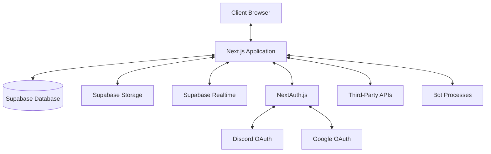
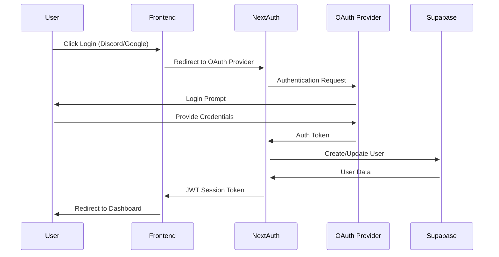
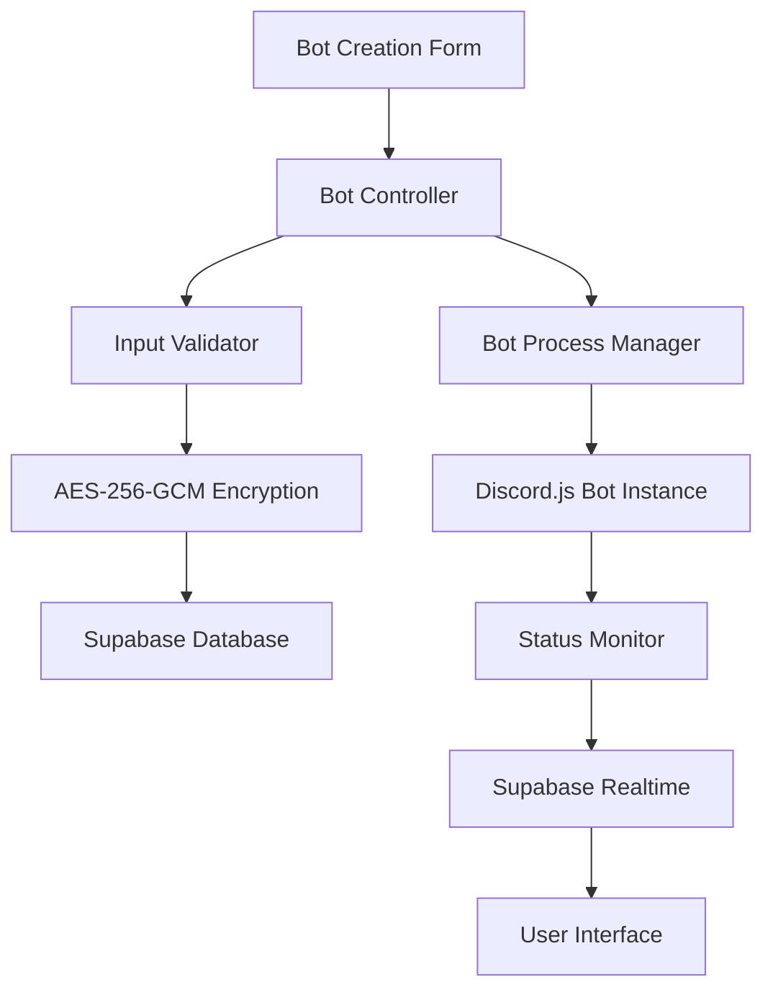
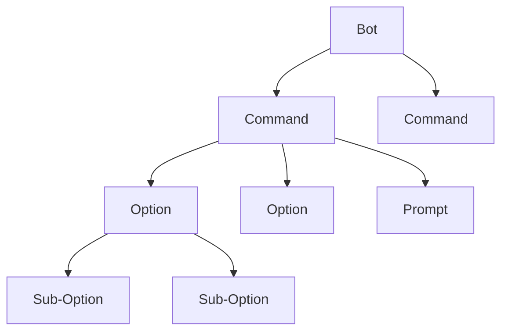
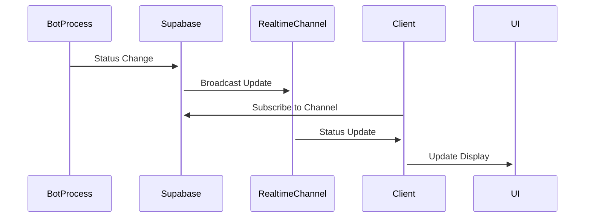
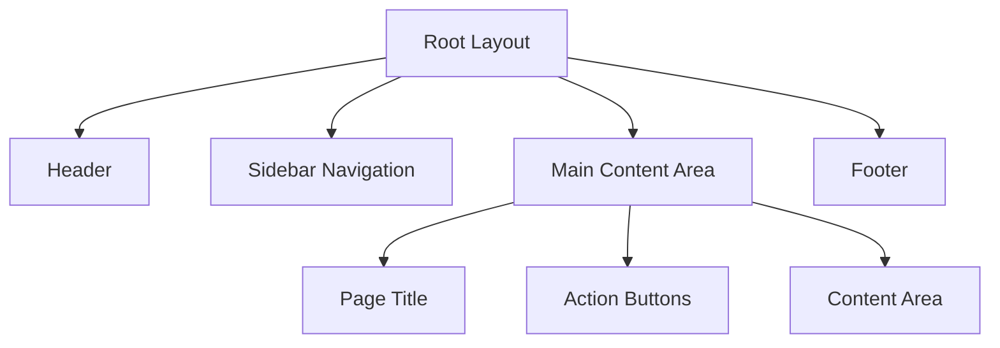
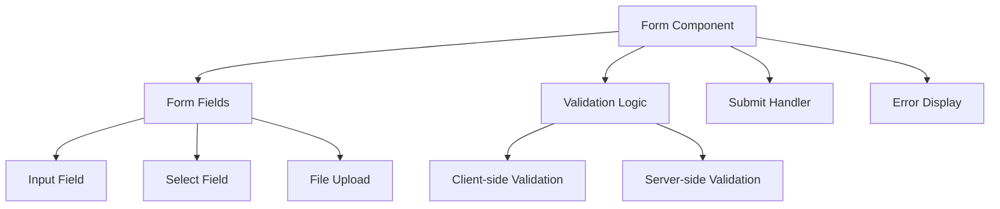
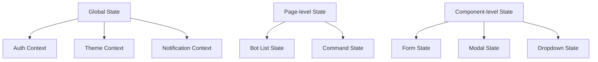

# System Patterns

## Architecture Overview

The Discord Bot Control Center follows a modern web application architecture with clear separation of concerns and a focus on security, scalability, and real-time capabilities.



## Core Design Patterns

### Authentication Flow

The system implements a secure authentication flow using NextAuth.js with Discord and Google OAuth providers:



### Bot Management Pattern

The system uses a controller pattern for bot management, allowing users to create, configure, and control their bots:



### Command Configuration Pattern

Commands follow a hierarchical structure with options and prompts:



### Real-time Updates Pattern

The system leverages Supabase Realtime for instant status updates:



## Data Models

### User Model

```typescript
interface User {
  id: string;
  email: string;
  displayName: string;
  avatarUrl?: string;
  provider: 'discord' | 'google' | 'email';
  role: 'user' | 'admin';
  settings: {
    theme: 'dark' | 'light';
    notifications: boolean;
    language: 'ja' | 'en';
  };
  createdAt: Date;
  updatedAt: Date;
}
```

### Bot Model

```typescript
interface Bot {
  id: string;
  userId: string;
  name: string;
  clientId: string;
  encryptedToken: string;
  avatarUrl?: string;
  status: 'online' | 'offline' | 'error';
  settings: {
    prefix?: string;
    autoRestart: boolean;
    logLevel: 'info' | 'warn' | 'error' | 'debug';
  };
  lastActive?: Date;
  createdAt: Date;
  updatedAt: Date;
}
```

### Command Model

```typescript
interface Command {
  id: string;
  botId: string;
  name: string;
  description: string;
  usage?: string;
  options: CommandOption[];
  promptId?: string;
  enabled: boolean;
  createdAt: Date;
  updatedAt: Date;
}

interface CommandOption {
  id: string;
  commandId: string;
  name: string;
  description: string;
  type: 'string' | 'integer' | 'boolean' | 'user' | 'channel';
  required: boolean;
  choices?: { name: string; value: string }[];
}
```

### Prompt Model

```typescript
interface Prompt {
  id: string;
  commandId: string;
  content: string;
  variables: string[];
  apiIntegration?: 'openai' | 'perplexity' | 'anthropic' | 'stability';
  createdAt: Date;
  updatedAt: Date;
}
```

## Security Patterns

### Token Encryption

Bot tokens and API credentials are encrypted using AES-256-GCM before storage:

```typescript
// Encryption
const encrypt = (text: string, secretKey: string): string => {
  const iv = crypto.randomBytes(16);
  const cipher = crypto.createCipheriv('aes-256-gcm', secretKey, iv);
  const encrypted = Buffer.concat([cipher.update(text, 'utf8'), cipher.final()]);
  const authTag = cipher.getAuthTag();
  return Buffer.concat([iv, authTag, encrypted]).toString('hex');
};

// Decryption
const decrypt = (encryptedHex: string, secretKey: string): string => {
  const buffer = Buffer.from(encryptedHex, 'hex');
  const iv = buffer.subarray(0, 16);
  const authTag = buffer.subarray(16, 32);
  const encrypted = buffer.subarray(32);
  const decipher = crypto.createDecipheriv('aes-256-gcm', secretKey, iv);
  decipher.setAuthTag(authTag);
  return decipher.update(encrypted) + decipher.final('utf8');
};
```

### Row Level Security

Supabase RLS policies ensure users can only access their own data:

```sql
-- Example RLS policy for bots table
CREATE POLICY "Users can only access their own bots"
ON bots
FOR ALL
USING (auth.uid() = user_id);
```

## Component Patterns

### Layout Structure

The application follows a consistent layout pattern:



### Form Patterns

Forms follow a consistent pattern with validation and error handling:



## State Management Patterns

The application uses a combination of React Context and local component state:


